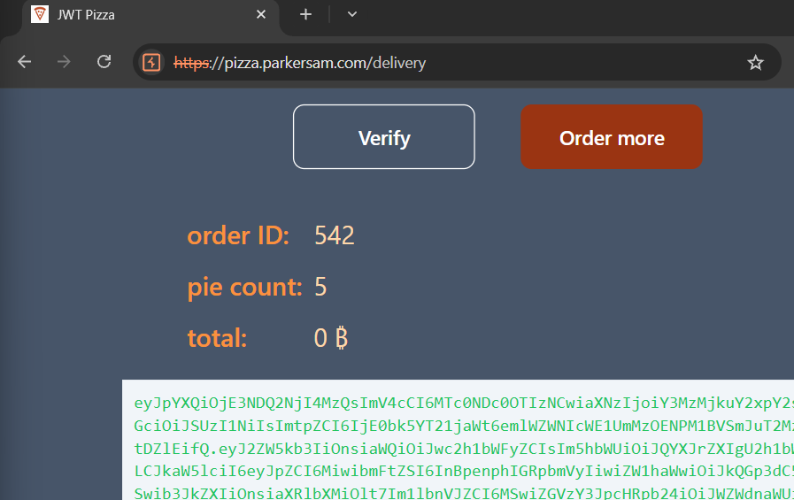
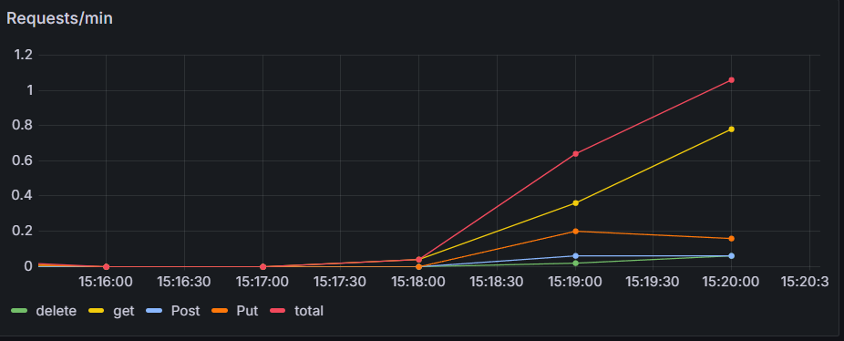
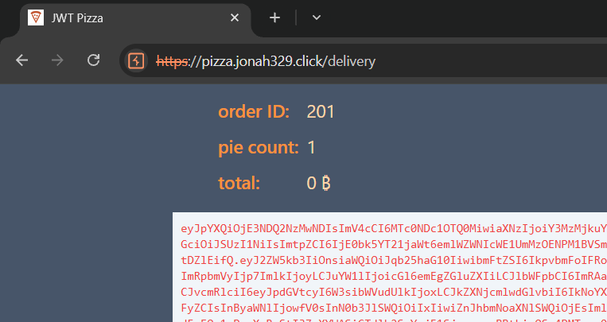
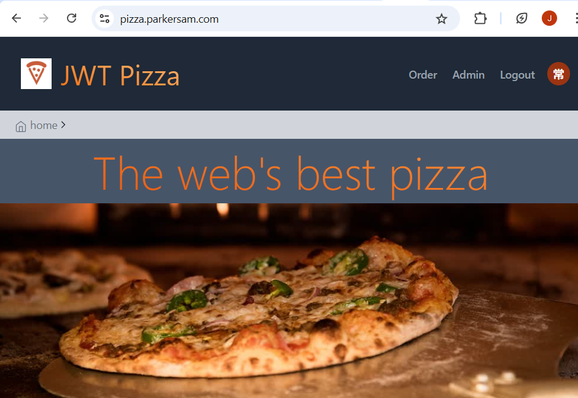

# Parker Shumard and Jonah Thurston Peer PennTesting

## Parker Self Attack

| Item           | Result                                                              |
| -------------- | ------------------------------------------------------------------- |
| Date           | April 14, 2025                                                      |
| Target         | pizza.parkersam.com                                                 |
| Classification | Server Request Forgery                                              |
| Severity       | 3                                                                   |
| Description    | Order request was intercepted and changed to be free                |
| Images         |                                              |
| Corrections    | Change order endpoint to use price from database instead of request |

## Jonah Self Attack

| Item           | Result                                                                                   |
| -------------- | ---------------------------------------------------------------------------------------- |
| Date           | April 10, 2025                                                                           |
| Target         | pizza.jonah329.click                                                                     |
| Classification | Insecure Design                                                                          |
| Severity       | 1                                                                                        |
| Description    | System was spammed with a bunch of requests and failed.                                  |
| Images         |    Site is not responding                                        |
| Corrections    | Could theoretically pay more for more DB connections, but I am not going to pay for that |

## Parker Peer Attack

| Item           | Result                                                       |
| -------------- | ------------------------------------------------------------ |
| Date           | April 14, 2025                                               |
| Target         | pizza.jonah329.click                                         |
| Classification | Server Request Forgery                                       |
| Severity       | 3                                                            |
| Description    | Intercepted pizza order request and changed price to be free |
| Images         |                              |
| Corrections    | Should not base price on request, rather on database         |

## Jonah Peer Attack

| Item           | Result                                                                    |
| -------------- | ------------------------------------------------------------------------- |
| Date           | April 10, 2025                                                            |
| Target         | pizza.parkersam.com                                                       |
| Classification | Identification and Authentication Failures                                |
| Severity       | 2                                                                         |
| Description    | Successfully guessed his default admin password, and logged in as admin   |
| Images         |    I can see the admin button on his site |
| Corrections    | Change admin password                                                     |

## Summary of Learnings

We learned that simple attacks can sometimes be the most effective. Jonah used a brute force DDoS attack on his own site, and then used a mix of social engineering and checking Parker's github repository for credentials (found in the load testing report). Parker found out that when ordering pizzas you could send whatever price that you wanted it to be, so he got a ton of free pizza. We learned that even when an application seems secure, there are many different ways to poke holes in it. It is important to know this so that we can be prepared to make our own websites secure for the rest of our careers.